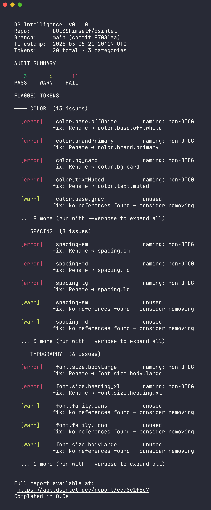

# dsintel

A CLI tool that audits design token files for quality and consistency issues. Supports the [W3C Design Tokens Community Group (DTCG)](https://tr.designtokens.org/format/) format.



## What it does

`dsintel audit` parses your token files and checks for:

- **Naming violations** — enforces DTCG dot-notation naming (catches camelCase, kebab-case, snake_case)
- **Unused tokens** — detects tokens that are never referenced as aliases
- **Semantic drift** — flags color tokens whose resolved values contradict their names (e.g. a "neutral" token with high saturation)

Each issue includes a severity level, category, and suggested fix.

## Install

```bash
npm install
npm run build
```

Requires Node.js >= 20.

## Usage

```bash
# Audit a token file
dsintel audit path/to/tokens.json

# Show all issues (default truncates to 5 per category)
dsintel audit path/to/tokens.json --verbose

# Machine-readable output
dsintel audit path/to/tokens.json --output json
```

### Try the examples

```bash
# Clean token file — passes audit
dsintel audit examples/healthy-tokens.json

# Token file with issues — naming violations, semantic drift, deprecated tokens
dsintel audit examples/messy-tokens.json
```

### Example token file (W3C DTCG format)

```json
{
  "color": {
    "$type": "color",
    "base": {
      "blue": { "$value": "#0066ff" }
    },
    "brand": {
      "primary": { "$value": "{color.base.blue}" }
    }
  },
  "spacing": {
    "$type": "dimension",
    "sm": { "$value": "8px" },
    "md": { "$value": "16px" }
  }
}
```

## Development

```bash
npm run dev          # Watch mode (TypeScript)
npm test             # Run tests
npm run test:watch   # Watch mode (tests)
npm run lint         # Type-check without emitting
```

## Project structure

```
src/
├── index.ts              # CLI entry point
├── parser/               # Token file parsing (DTCG format)
├── rules/                # Audit rules (naming, unused, semantic-drift)
└── reporter/             # CLI report formatting
test/
├── parser.test.ts        # Parser tests
├── naming.test.ts        # Naming rule tests
└── fixtures/             # Sample token files
```

## License

MIT
